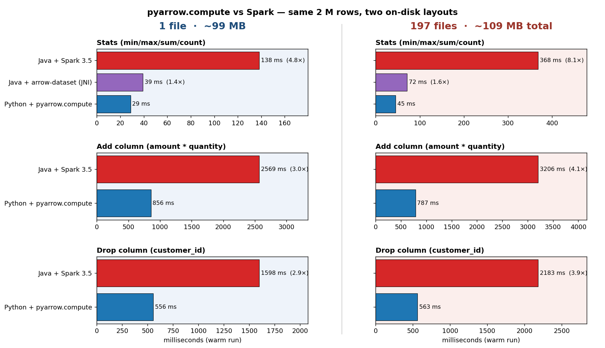

# The benchmark it

> 2 000 000 orders rows · same data, two layouts on disk:
>
> - **Left column** — one ~100 MB parquet (the "happy path")
> - **Right column** — 197 small parquets ~0.5 MB each (the S3 reality)
>
> Each runtime warms its JIT / Catalyst / JNI on a separate parquet;
> both test layouts are pre-loaded into the OS page cache so disk
> latency is shared evenly. Single CPU core.

## What you're looking at

- **pyarrow.compute is essentially flat across layouts.** Stats slows
  by 1.6×, but `add_column` actually **speeds up** with more files
  (C++ engine reads many files in parallel through internal threads).
  No task scheduler, no plan re-optimisation, no per-file fixed cost.
- **Spark's relative cost grows with file count** — every operation's
  slow-down ratio increases in the right column. Note that this is
  *despite* Spark's automatic small-file bin-packing
  (`spark.sql.files.openCostInBytes` = 4 MB, `maxPartitionBytes` = 128 MB),
  which collapses 197 files into ~7 partitions. Without it the gap
  would be far worse.
- **`arrow-dataset` Java is the same C++ engine** as pyarrow — within
  ~1.4–1.6× across both layouts. The Java path costs JNI, a shade
  plugin, `--add-opens`, and an ~1.0 s cold start; Python costs
  `pip install pyarrow`.
- The Java native implementation (ColumnReader or AVRO) is so slow that I didn't even include it here

## What this means in production

The 1-file column is the benchmark Spark looks good in. Real workloads
look like the 197-file column: hourly partitions, daily landing files,
Iceberg / Hudi commits, S3 dumps. Spark is **designed** for that
volume — but pays for it with a per-file fixed cost that pyarrow.compute
simply doesn't have, because there is no task scheduler.

## The hidden cost of technology

| Variant in the repo | Stats time | Why it's there |
|---------------------|-----------:|----------------|
| `parquet-avro` (pure Java)   | 22 018 ms | **430× slower** — deserialises every record into heap objects |
| Spark + VectorizedReader     |    138 ms | Catalyst + scheduler + JIT |
| Java SIMD (incubator vector) |    323 ms | Bottleneck is per-value decode, not arithmetic — SIMD doesn't help |
| `arrow-dataset` (JNI)        |     39 ms | Same C++ engine PyArrow uses |
| **`pyarrow.compute`**        |     29 ms | C++ decode + C++ compute, no copy |
