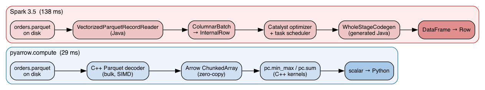

# The code

> The design pattern: **read columnar, compute columnar, only scalars cross
> into Python**. Tables are immutable but cheap to manipulate — adding or
> dropping a column is a metadata operation on shared Arrow buffers.



## 1) Statistics — one column, four aggregates

```python
import pyarrow.parquet as pq
import pyarrow.compute as pc

arr = pq.read_table(path, columns=[column]).column(column)
mm  = pc.min_max(arr)
print(mm["min"].as_py(), mm["max"].as_py(),
      pc.sum(arr).as_py(), pc.count(arr).as_py())
```

The Spark equivalent — same idea, ~4.8× the wall-clock time on one
file, ~8× when the input is many small parquets:

```java
Row r = spark.read().parquet(path).agg(
    min(col(column)), max(col(column)),
    sum(col(column)), count(col(column))
).first();
```

## 2) Add a computed column — `total = amount * quantity`

```python
table = pq.read_table(src)
total = pc.multiply(
    pc.cast(table["amount"],   "float64"),
    pc.cast(table["quantity"], "float64"),
)
pq.write_table(table.append_column("total", total), dst, compression="zstd")
```

`pc.multiply` runs in C++ across the whole column. `append_column` is
metadata-only — no row copy, no DAG planning.

## 3) Drop a column — `customer_id`

```python
table = pq.read_table(src)
pq.write_table(table.drop_columns(["customer_id"]), dst, compression="zstd")
```

Two lines. The buffer for the dropped column is simply not referenced
in the output schema — Python releases it. No shuffle, no broadcast,
no executor.
