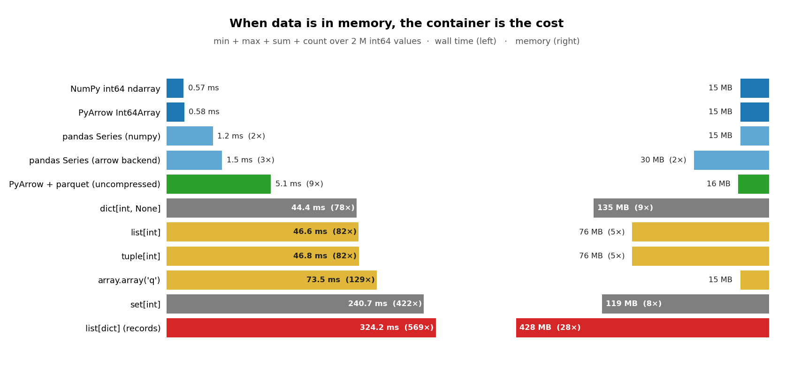

# "But my data is already in memory"

> *OK, pyarrow.compute is fast for parquet. But our service holds the
>  data in a list of dicts / a pandas frame / a dict by id. Does any
>  of this matter once you're already in RAM?*

The short answer: **the container is the cost.** Same 2 M int64 values,
same four aggregates (`min + max + sum + count`), nine different
in-memory holdings — wall time spans **three orders of magnitude**.

## Conslusion

> **Cold-reading the same data from an uncompressed parquet on disk
> (5 ms) is faster than calling `min()` on a `list[int]` already in RAM
> (47 ms).**

**Python object layout**
*list[int], list[dict], set, dict*
high memory usage, bad memory locality, hash table bottleneck

**Dense buffer bez compute enginu**
*array.array*
low memory usage, slow python iteration

**Dense buffer + specialized compute**
*NumPy, Arrow, Polars, DuckDB*
low memory usage, fast computation, win+win

## What to take from this

- **Pick the data structure for the dominant operation.**
- **If you find yourself iterating a `list[dict]` for aggregation:
  build a `pa.Table` from the same data and call `pc.*`** — typically
  100–500× faster for the same shape of work. Construction cost is
  paid once; queries are free.
- **The disk is not the slow part** for analytics on Parquet — the
  Python object model is.
